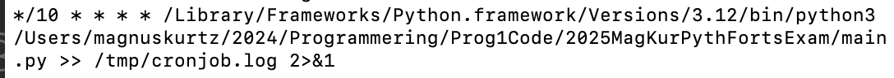
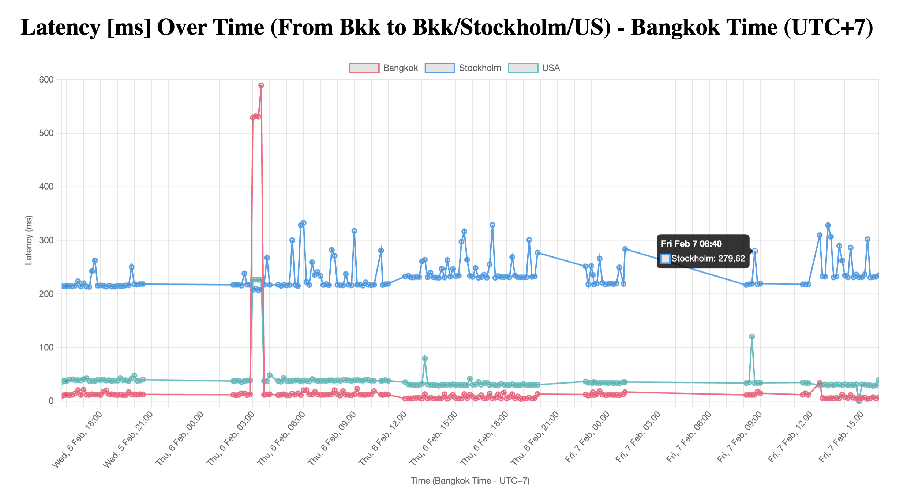

# Internet performace/latency app
## Background
I am in Bangkok, sometimed code from home (with and without VPN), and sometimes from co-working space with dedicated VPN.
I have experienced that performace vary up and down, sometimes a pattern over the day, and sometimes decreased performance occasionally. To see if any conclusions can be drawn, I want to measure over time and have the data presented with a curve over time. I want to measure locally (Thailand/Bangkok) and against Europe/Sweden and the USA.
## Method
By using the appropriate ping library in python, data regarding latency (in milliseconds [ms]) is provided. I store this in a sqlite database, to get continous data I automice with a cron job. I then use flask to present the data. I test some of the functionality with pytest. To make code a bit safer - I save the db url in a config file that is then excluded from github repository by gitignore.
## Parts involved

A. **Secure Programming** ✅  
B. Advanced Data Management (<b style="color:blue;">**Pandas**</b>, NumPy) ✅  
C. API Integrations (Requests, <b style="color:blue;">**JSON**</b>) ✅  
D. Web Development (<b style="color:blue;">**Flask**</b>, Django) ✅  
E. <b style="color:blue;">**Automation**</b> or Multithreading ✅  
F. Unit Testing and Debugging (<b style="color:blue;">**pytest**</b>, logging) ✅  
G. File Management or Encryption  
H. <b style="color:blue;">**SQL**</b> with Python ✅  

## Pre service process

| Create database | Test database select and ping function with **pytest** |

## Service process

| Ping IP addresses in Asia(local), Stockholm and USA | Store in database witt **SQL** sqlite, choose to put the database-url in a config file that is included in .gitignore to show that I master basic parts of **secure programming** | Create **automation** with cron job on Mac | Then publish to webb on local_host by collecting dataframe from sqlite by using **Flask**, then use **Pandas** to tweak, convert and sort data, and finally use **JSON**/jsonify (Flask function) to convert the Python objects (like the dataframe / dictionaries or lists) into JSON responses, which is then returned from the Flask route to the html-template as foundation to the graphs.| 

## Service file flow architecture

***cron job***  
| **main** | => | /app/__init__.py | => | /app/ping.py | => | /app/db.py |  
  
***Web publishing***  
| /app/webben.py |  
## View cron job setup and web result
Here is the setup for the cron job running every 10 minutes.  
  

Here is a screen dump showing cron job running every 10 minutes.  
 
  
And here is a screen dump of web result.  
  

.    
.  
.  
.  

#### Terminal and class examples

1. Install packege `pip install`

```python
class Config:
    DB_PATH = "/Users/magnuskurtz/2024/Programmering/Prog1Code/2025MagKurPythFortsExam/db_storage/ping_results.db"

```